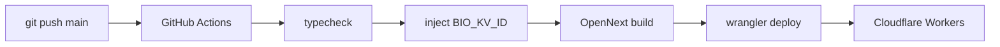
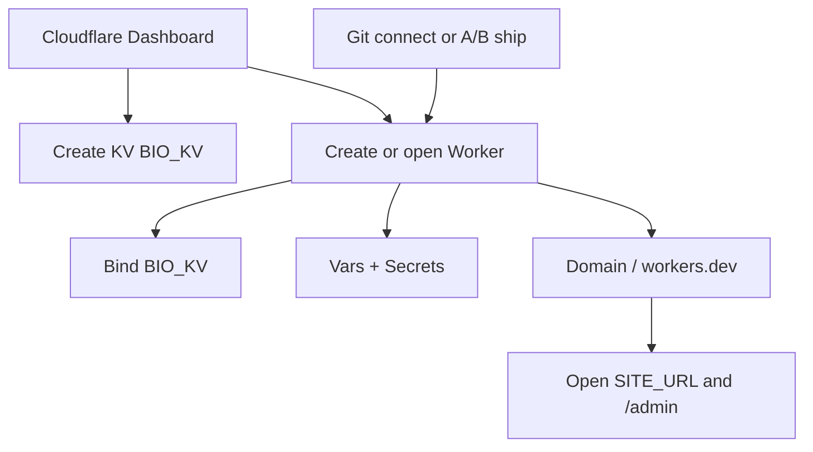

<p align="center">
  
</p>

<h1 align="center">LinkBio-workers</h1>

<p align="center">
  Personal <strong>Bio / Digital Card</strong> on <strong>Cloudflare Workers</strong><br/>
  Next.js 15 · OpenNext · KV · multi-theme · optional remote backup
</p>

<p align="center">
  <a href="https://github.com/royecc/LinkBio-workers/stargazers"></a>
  <a href="https://github.com/royecc/LinkBio-workers/network/members"></a>
  <a href="https://github.com/royecc/LinkBio-workers/graphs/contributors"></a>
  <a href="https://github.com/royecc/LinkBio-workers/issues"></a>
  <a href="./LICENSE"></a>
</p>

<p align="center">
  
  
  
  
  
</p>

<p align="center">
  <a href="./README.md">简体中文</a> ·
  <a href="./README.en.md"><strong>English</strong></a> ·
  <a href="https://github.com/royecc/LinkBio-workers">GitHub</a>
</p>

---

## Table of contents

- [Features](#features)
- [Stack](#stack)
- [Quick start (local)](#quick-start-local)
- [Environment variables](#environment-variables)
- [Deploy](#deploy)
  - [Option A: CLI (Wrangler)](#option-a-cli-wrangler)
  - [Option B: GitHub Actions](#option-b-github-actions)
  - [Option C: Dashboard UI](#option-c-dashboard-ui)
- [Optional remote backup](#optional-remote-backup)
- [Data model (KV)](#data-model-kv)
- [Visual themes](#visual-themes)
- [Layout](#layout)
- [Contributors](#contributors)
- [License](#license)

---

## Features

| Area | Notes |
|------|--------|
| Public bio | Profile, links, footer; SSR + visitor toolbar (color / locale) |
| Admin | `/admin` session auth, CSRF, profile / links / theme / data |
| Themes | `src/themes/*` bundled at build time; `data-theme-id` switch |
| Link icons | `src/icons/*` registry at build time; syncs `public/icons/` |
| Analytics | Split KV counters (PV, clicks); login rate limit |
| Backup | Local JSON import/export; optional WebDAV + Gist (parallel) |

---

## Stack

- **Next.js 15** App Router (Server Components first)
- **Tailwind CSS v4** + public shadcn-style UI · admin **Cloudflare Kumo**
- **OpenNext Cloudflare** edge deploy
- **Cloudflare KV** for content, analytics, backup config

---

## Quick start (local)

**Requires:** Node.js **22+** · Wrangler recommended

```bash
git clone https://github.com/royecc/LinkBio-workers.git
cd LinkBio-workers
npm install --legacy-peer-deps
cp .dev.vars.example .dev.vars
# set ADMIN_PASSWORD and SESSION_SECRET in .dev.vars
npm run dev
```

| Entry | URL |
|-------|-----|
| Public | http://localhost:3000 |
| Admin | http://localhost:3000/admin |

If bindings are missing:

```bash
npm run preview   # full OpenNext + workerd preview
```

### Scripts

| Command | Description |
|---------|-------------|
| `npm run dev` | Build themes/icons + Next dev server |
| `npm run build` | Next production build |
| `npm run build:assets` | Themes + icons (`build:themes` && `build:icons`) |
| `npm run build:themes` | Validate + generate theme registry / CSS |
| `npm run build:icons` | Validate + generate icon registry; sync `public/icons/` |
| `npm run build:worker` | OpenNext worker bundle |
| `npm run preview` | Build + local Workers runtime |
| `npm run deploy` | Build + deploy to Cloudflare |
| `npm run typecheck` | `tsc --noEmit` (runs `build:assets` first) |

---

## Environment variables

Three groups: **Wrangler `[vars]`**, **Secrets**, and **local / CI only**.

### 1. Worker runtime · Vars (`wrangler.toml` → `[vars]`)

| Variable | Type | Required | Default / example | Purpose |
|----------|------|----------|-------------------|---------|
| `SITE_NAME` | string | recommended | `LinkBio` | Display name |
| `SITE_URL` | string | recommended | `https://xxx.workers.dev` | Canonical public URL (**not** localhost in prod) |
| `DEFAULT_THEME` | string | no | `minimal` | Default theme id when KV theme empty/invalid |

### 2. Worker runtime · Secrets (never commit)

| Variable | Required | How to set | Purpose |
|----------|----------|------------|---------|
| `ADMIN_PASSWORD` | **yes** | `wrangler secret put ADMIN_PASSWORD` | Admin login password; **never in backup JSON** |
| `SESSION_SECRET` | **yes** | `wrangler secret put SESSION_SECRET` | Session HMAC secret; **never in backup** |

### 3. Local dev (`.dev.vars`, gitignored)

From [`.dev.vars.example`](./.dev.vars.example):

| Variable | Purpose |
|----------|---------|
| `NEXTJS_ENV` | Usually `development` |
| `ADMIN_PASSWORD` | Local admin password |
| `SESSION_SECRET` | Local session secret |

Bindings such as `BIO_KV` come from Wrangler / OpenNext, not plain env strings.

### 4. GitHub Actions (CI only)

| Name | Where | Required | Purpose |
|------|--------|----------|---------|
| `CF_API_TOKEN` or `CLOUDFLARE_API_TOKEN` | Secrets | **yes** | Deploy token |
| `CF_ACCOUNT_ID` or `CLOUDFLARE_ACCOUNT_ID` | Secrets | **yes** | Account id |
| `BIO_KV_ID` | Vars or Secrets | **yes** | Production KV id (injected into `wrangler.toml`) |
| `BIO_KV_PREVIEW_ID` | Vars or Secrets | no | Preview KV id; falls back to `BIO_KV_ID` |

> Worker secrets `ADMIN_PASSWORD` / `SESSION_SECRET` must still be set in the Cloudflare Dashboard or CLI — **not** auto-injected by Actions.

### 5. Bindings (not plain env strings)

| Binding | Type | Purpose |
|---------|------|---------|
| `BIO_KV` | KV Namespace | Content, analytics, backup config |
| `ASSETS` | Assets | OpenNext static assets |
| `WORKER_SELF_REFERENCE` | Service | OpenNext self-reference |

### 6. Visitor cookies (browser)

| Cookie | Values | Purpose |
|--------|--------|---------|
| `lb_color` | `system` \| `light` \| `dark` | Override site color mode |
| `lb_locale` | `auto` \| `zh-CN` \| `en` | Visitor UI language |

---

## Deploy

Pick **one** path (or mix: configure in the Dashboard UI, ship code via A/B). You need a Cloudflare account.

| Option | Best for | Ship code | Configure resources / secrets |
|--------|----------|-----------|--------------------------------|
| **A. CLI** | Local quick deploys | `npm run deploy` | CLI or Dashboard |
| **B. GitHub Actions** | Push-to-main | CI | Dashboard + GitHub Vars |
| **C. Dashboard UI** | Prefer browser / less terminal | Connect Git or upload; or configure only in UI after first deploy | **All in Dashboard** |

### Shared setup

Create KV + secrets via **CLI** or the **Dashboard** (see Option C). CLI example:

```bash
npx wrangler kv namespace create BIO_KV
npx wrangler kv namespace create BIO_KV --preview

npx wrangler secret put ADMIN_PASSWORD
npx wrangler secret put SESSION_SECRET
```

Edit Dashboard vars as needed: `SITE_NAME`, `SITE_URL`, `DEFAULT_THEME`.

---

### Option A: CLI (Wrangler)

Best for solo / quick deploys.

1. Edit local `wrangler.toml`:
   - Replace `REPLACE_WITH_YOUR_KV_NAMESPACE_ID` / `REPLACE_WITH_YOUR_KV_PREVIEW_ID`
   - Set `[vars]` (`SITE_NAME`, `SITE_URL`, `DEFAULT_THEME`)
   - **Do not commit real KV ids** to a public repo

2. Deploy:

```bash
npm install --legacy-peer-deps
npm run deploy
```

3. Open `SITE_URL`, then `/admin` with `ADMIN_PASSWORD`.

---

### Option B: GitHub Actions

Best for push-to-main deploys. Workflow: [`.github/workflows/deploy.yml`](./.github/workflows/deploy.yml).

1. Push this repo to GitHub.  
2. **Settings → Secrets and variables → Actions**:

| Type | Name | Purpose |
|------|------|---------|
| Secret | `CF_API_TOKEN` | Deploy |
| Secret | `CF_ACCOUNT_ID` | Account |
| Variable or Secret | `BIO_KV_ID` | Production KV |
| Variable or Secret (optional) | `BIO_KV_PREVIEW_ID` | Preview KV |

3. Set Worker secrets in Cloudflare: `ADMIN_PASSWORD`, `SESSION_SECRET`.  
4. Push to `main` / `master`, or run **Deploy** manually.  
5. CI runs: `npm ci` → `typecheck` → inject KV ids → OpenNext build → `wrangler deploy`.



---

### Option C: Dashboard UI

Best if you want **resources, bindings, secrets, domains, and day-to-day ops in the browser**.  
Note: this app is **OpenNext → Worker** (not a static HTML drop). The Dashboard owns **Cloudflare config**; code still needs a **build** (Connect Git in the Dashboard, or ship builds via A/B while you only touch the UI for ops).

#### C1. Create resources in the console

Sign in to [Cloudflare Dashboard](https://dash.cloudflare.com/) → select account:

1. **Workers & Pages → KV**  
   - **Create a namespace** (e.g. `BIO_KV`)  
   - Copy the namespace id for bindings  
2. Optionally create a separate preview namespace.

#### C2. Create / open the Worker and bind

1. **Workers & Pages → Create**  
   - If available: **Connect to Git** and point at this repo (see C4)  
   - Or deploy once with Option A so Worker `linkbio-workers` exists, then **only use the UI for config**  
2. Open the Worker → **Settings → Bindings** (or Variables and Secrets):  
   - Add **KV Namespace** binding named exactly `BIO_KV`  
   - Keep OpenNext-related bindings consistent with `wrangler.toml` (`ASSETS`, self-reference service, etc.—usually present after first CLI/CI deploy)  
3. **Settings → Variables and Secrets**  
   - **Variables:** `SITE_NAME`, `SITE_URL`, `DEFAULT_THEME`  
   - **Secrets:** `ADMIN_PASSWORD`, `SESSION_SECRET` (use **Add secret**; never commit them)

#### C3. Domains & access (UI)

1. Worker → **Settings → Domains & Routes** (or Triggers)  
2. Enable `*.workers.dev` and/or attach a **Custom Domain**  
3. Set `SITE_URL` to the final public URL  
4. Open the site and `/admin` with the secret password  

#### C4. Ship from the UI (optional: Connect Git)

If your account has **Workers Builds / Connect to Git**:

1. Connect the GitHub repository  
2. Suggested commands (align with local):  
   - **Install:** `npm ci --legacy-peer-deps`  
   - **Build:** `npm run build:worker`  
3. Configure as a **Worker** project (not a static Pages site)  
4. Provide KV id injection or rely on Dashboard bindings as supported by your plan  
5. Track deploys under Dashboard **Deployments** without running Wrangler locally  

> **Tip:** If Git builds in the Dashboard are awkward for OpenNext, use **UI for ops (C2–C3)** and **A/B for code**—you still get a fully browser-based config experience.

#### C5. Day-to-day ops in the UI

| Task | Dashboard location |
|------|--------------------|
| Site name / default theme / public URL | Worker → Settings → Variables |
| Login password / session secret | Worker → Settings → Secrets |
| KV binding | Worker → Settings → Bindings |
| Logs | Worker → Logs |
| Custom domain / SSL | Domains & Routes / DNS |
| Rollback | Deployments history (if versioning enabled) |



---

## Optional remote backup

Configure under **Admin → Data**:

| Capability | Notes |
|------------|--------|
| Local export / import | JSON: `profile` / `links` / `settings` / `analytics` / optional `backup`; **never** env secrets |
| WebDAV | Independent toggle; `PUT`/`GET` file URL (Basic auth) |
| GitHub Gist | Independent toggle; token + optional gist id |
| Auto-backup | After profile/links/settings saves (`waitUntil`); **not** analytics |
| Failure policy | Status only — never blocks content saves |

KV: `backup:config`, `backup:state`.

---

## Data model (KV)

| Key | Content |
|-----|---------|
| `profile` | Bio profile |
| `links` | Link list |
| `settings` | Theme, locale, footer… |
| `analytics:*` | Split counters |
| `rate:login:*` | Login rate limit |
| `backup:config` | Remote backup config |
| `backup:state` | Last backup status |

---

## Visual themes

Themes live under `src/themes/<id>/` and are bundled at build time.

| Attribute | Meaning |
|-----------|---------|
| `data-theme` | `system` \| `light` \| `dark` |
| `data-theme-id` | `aurora` \| `minimal` \| `apple` \| `anthropic` \| `hono-old` \| `nodeseek` \| `qtcool` \| `liquid-glass` \| … |

Order: valid `settings.theme` → `env.DEFAULT_THEME` (default `minimal`) → fallback `aurora`.

```bash
npm run build:themes
```

See [src/themes/README.md](./src/themes/README.md). Admin descriptions follow UI locale (`zh-CN` / `en`).

---

## Link icons

Built-in link icons live under `src/icons/*.svg` (+ optional `meta.json`) and are registered at build time. `public/icons/` is **generated** — do not edit by hand.

```bash
npm run build:icons
```

Add an icon: drop `src/icons/{id}.svg` → build → it appears in the admin picker. See [src/icons/README.md](./src/icons/README.md).

---

## Layout

```
app/                 # Next.js routes
components/ui/       # public shadcn-style UI
components/public/   # bio + toolbar
components/admin/    # admin shell
lib/                 # kv, session, backup, i18n, themes, icons…
src/themes/          # visual packs
src/icons/           # link icon sources (*.svg + meta.json → registry)
public/icons/        # generated icon assets (from build:icons)
docs/logo.jpg        # repo logo
scripts/build-themes.mjs
scripts/build-icons.mjs
wrangler.toml
README.md / README.en.md
```

---

## Contributors

Thanks to everyone who has contributed:

<p align="left">
  <a href="https://github.com/royecc/LinkBio-workers/graphs/contributors">
    
  </a>
</p>

- Contributors: https://github.com/royecc/LinkBio-workers/graphs/contributors  
- Stargazers: https://github.com/royecc/LinkBio-workers/stargazers  

PRs welcome. Before submitting:

```bash
npm run typecheck
```

---

## License

[GNU General Public License v3.0 or later](./LICENSE) (**GPL-3.0-or-later**)

<p align="center">
  <sub>LinkBio Workers Pages · Built for Cloudflare</sub>
</p>
