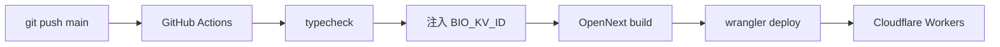
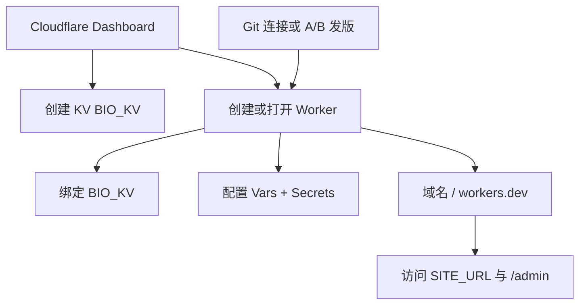

<p align="center">
  
</p>

<h1 align="center">LinkBio-workers</h1>

<p align="center">
  运行在 <strong>Cloudflare Workers</strong> 上的个人 <strong>Bio / 数字名片</strong> 平台<br/>
  Next.js 15 · OpenNext · KV · 多主题 · 可选远端备份
</p>

<p align="center">
  <a href="https://github.com/royecc/LinkBio-workers/stargazers"></a>
  <a href="https://github.com/royecc/LinkBio-workers/network/members"></a>
  <a href="https://github.com/royecc/LinkBio-workers/graphs/contributors"></a>
  <a href="https://github.com/royecc/LinkBio-workers/issues"></a>
  <a href="./LICENSE"></a>
</p>

<p align="center">
  
  
  
  
  
</p>

<p align="center">
  <a href="./README.md"><strong>简体中文</strong></a> ·
  <a href="./README.en.md">English</a> ·
  <a href="https://github.com/royecc/LinkBio-workers">GitHub</a>
</p>

---

## 目录

- [功能一览](#功能一览)
- [技术栈](#技术栈)
- [快速开始（本地开发）](#快速开始本地开发)
- [环境变量一览](#环境变量一览)
- [部署方式](#部署方式)
  - [方式 A：命令行（Wrangler CLI）](#方式-a命令行wrangler-cli)
  - [方式 B：GitHub Actions 自动部署](#方式-bgithub-actions-自动部署)
  - [方式 C：界面化部署（Cloudflare Dashboard）](#方式-c界面化部署cloudflare-dashboard)
- [可选远端备份](#可选远端备份)
- [数据模型（KV）](#数据模型kv)
- [视觉主题](#视觉主题)
- [目录结构](#目录结构)
- [贡献者](#贡献者)
- [许可证](#许可证)

---

## 功能一览

| 模块 | 说明 |
|------|------|
| 前台名片 | 资料、链接列表、页脚；SSR + 访客工具条（深浅色 / 语言） |
| 管理后台 | `/admin` 会话登录、CSRF、资料 / 链接 / 主题 / 数据 |
| 多主题 | `src/themes/*` 构建期打包；后台切换 `data-theme-id` |
| 链接图标 | `src/icons/*` 构建期 registry + 同步 `public/icons/` |
| 统计 | 拆分 KV 计数（PV、链接点击）；登录失败限流 |
| 备份 | 本地 JSON 导入导出；可选 WebDAV + Gist 并行远端备份 |

---

## 技术栈

- **Next.js 15** App Router（默认 Server Components）
- **Tailwind CSS v4** + 前台 shadcn 风格组件 · 后台 **Cloudflare Kumo**
- **OpenNext Cloudflare** 边缘部署
- **Cloudflare KV** 存储内容、统计与备份配置

---

## 快速开始（本地开发）

**要求：** Node.js **22+** · 建议已安装 Wrangler

```bash
git clone https://github.com/royecc/LinkBio-workers.git
cd LinkBio-workers
npm install --legacy-peer-deps
cp .dev.vars.example .dev.vars
# 编辑 .dev.vars 中的 ADMIN_PASSWORD、SESSION_SECRET
npm run dev
```

| 入口 | 地址 |
|------|------|
| 前台 | http://localhost:3000 |
| 后台 | http://localhost:3000/admin |

本地若缺少 Cloudflare 绑定，可用：

```bash
npm run preview   # OpenNext + workerd 完整 Worker 预览
```

### 常用命令

| 命令 | 说明 |
|------|------|
| `npm run dev` | 构建主题/图标 + Next 开发服务器 |
| `npm run build` | 生产构建（Next） |
| `npm run build:assets` | 主题 + 图标构建（`build:themes` && `build:icons`） |
| `npm run build:themes` | 校验并生成主题 registry / CSS |
| `npm run build:icons` | 校验并生成图标 registry，同步 `public/icons/` |
| `npm run build:worker` | OpenNext Worker 产物 |
| `npm run preview` | 构建并在本地 Workers 运行时预览 |
| `npm run deploy` | 构建并部署到 Cloudflare |
| `npm run typecheck` | `tsc --noEmit`（会先跑 `build:assets`） |

---

## 环境变量一览

分三类：**Wrangler `[vars]`（明文配置）**、**Secrets（密钥）**、**本地 / CI 专用**。

### 1. Worker 运行时 · Vars（`wrangler.toml` → `[vars]`）

| 变量 | 类型 | 必填 | 默认 / 示例 | 说明 |
|------|------|------|-------------|------|
| `SITE_NAME` | string | 建议 | `LinkBio` | 站点显示名（后台品牌、页脚等） |
| `SITE_URL` | string | 建议 | `https://xxx.workers.dev` | 公网 canonical URL；**生产勿填 localhost** |
| `DEFAULT_THEME` | string | 否 | `minimal` | KV `settings.theme` 为空/非法时的默认主题 id（极简） |

### 2. Worker 运行时 · Secrets（勿提交到 Git）

| 变量 | 必填 | 设置方式 | 说明 |
|------|------|----------|------|
| `ADMIN_PASSWORD` | **是** | `wrangler secret put ADMIN_PASSWORD` 或 Dashboard | 后台登录密码；**永不写入备份 JSON** |
| `SESSION_SECRET` | **是** | `wrangler secret put SESSION_SECRET` | 会话 HMAC 密钥；建议随机长字符串；**永不写入备份** |

### 3. 本地开发（`.dev.vars`，gitignored）

复制自 [`.dev.vars.example`](./.dev.vars.example)：

| 变量 | 说明 |
|------|------|
| `NEXTJS_ENV` | 一般为 `development` |
| `ADMIN_PASSWORD` | 本地后台密码 |
| `SESSION_SECRET` | 本地会话密钥 |

Bindings（`BIO_KV` 等）由 Wrangler / OpenNext 开发环境注入，不是普通环境变量字符串。

### 4. GitHub Actions 部署用（仅 CI）

| 名称 | 位置 | 必填 | 说明 |
|------|------|------|------|
| `CF_API_TOKEN` 或 `CLOUDFLARE_API_TOKEN` | Secrets | **是** | Cloudflare API Token |
| `CF_ACCOUNT_ID` 或 `CLOUDFLARE_ACCOUNT_ID` | Secrets | **是** | 账号 ID |
| `BIO_KV_ID` | Vars 或 Secrets | **是** | 生产 KV namespace id（CI 注入 `wrangler.toml`） |
| `BIO_KV_PREVIEW_ID` | Vars 或 Secrets | 否 | 预览 KV id；默认回退为 `BIO_KV_ID` |

> Worker 上的 `ADMIN_PASSWORD` / `SESSION_SECRET` 仍须在 Cloudflare Dashboard 或 CLI 单独配置，**不会**由 Actions 自动写入。

### 5. 绑定（Bindings，非 env 字符串）

| 绑定名 | 类型 | 说明 |
|--------|------|------|
| `BIO_KV` | KV Namespace | 资料、链接、设置、统计、备份配置 |
| `ASSETS` | Assets | OpenNext 静态资源 |
| `WORKER_SELF_REFERENCE` | Service | OpenNext 自引用服务 |

### 6. 访客 Cookie（浏览器，非 Worker env）

| Cookie | 取值 | 说明 |
|--------|------|------|
| `lb_color` | `system` \| `light` \| `dark` | 覆盖站点默认深浅色 |
| `lb_locale` | `auto` \| `zh-CN` \| `en` | 访客界面语言偏好 |

---

## 部署方式

三种方式任选其一（可组合：用 C 做资源与密钥，用 A/B 发版）。**都需要 Cloudflare 账号**。

| 方式 | 适合 | 代码发布 | 资源 / 密钥配置 |
|------|------|----------|-----------------|
| **A. CLI** | 本机快速发布 | 本机 `npm run deploy` | 可本机或 Dashboard |
| **B. GitHub Actions** | 推送即上线 | CI 自动 | Dashboard Secrets + GitHub Vars |
| **C. 界面化** | 少碰命令行、运维看面板 | Dashboard 连接 Git / 上传，或首次 CLI 后只在界面改配置 | **全程 Dashboard** |

### 公共准备

任选 **CLI** 或 **Dashboard 界面** 创建 KV 与密钥（见方式 C 的界面步骤）。CLI 示例：

```bash
# 1. 创建 KV（记下生产 / 预览 id）
npx wrangler kv namespace create BIO_KV
npx wrangler kv namespace create BIO_KV --preview

# 2. 配置登录密钥（生产 Worker）
npx wrangler secret put ADMIN_PASSWORD
npx wrangler secret put SESSION_SECRET
```

在 Cloudflare Dashboard 中可修改 Vars：`SITE_NAME`、`SITE_URL`、`DEFAULT_THEME`。

---

### 方式 A：命令行（Wrangler CLI）

适合个人本机发布、快速试部署。

1. 编辑本地 `wrangler.toml`：
   - 将 `REPLACE_WITH_YOUR_KV_NAMESPACE_ID` / `REPLACE_WITH_YOUR_KV_PREVIEW_ID` 换成真实 KV id  
   - 按需修改 `[vars]` 中的 `SITE_NAME`、`SITE_URL`、`DEFAULT_THEME`  
   - **勿把含真实 KV id 的 `wrangler.toml` 提交到公开仓库**（可用本地改动 + 不 push，或私有 fork）

2. 部署：

```bash
npm install --legacy-peer-deps
npm run deploy
# 等价于：build:assets（themes + icons）→ OpenNext build → wrangler deploy
```

3. 打开 `SITE_URL`，访问 `/admin` 用 `ADMIN_PASSWORD` 登录。

---

### 方式 B：GitHub Actions 自动部署

适合 `main` 推送即上线、多人协作。工作流见 [`.github/workflows/deploy.yml`](./.github/workflows/deploy.yml)。

1. Fork / 推送本仓库到 GitHub。  
2. 在仓库 **Settings → Secrets and variables → Actions** 配置：

| 类型 | 名称 | 示例用途 |
|------|------|----------|
| Secret | `CF_API_TOKEN` | 部署权限 |
| Secret | `CF_ACCOUNT_ID` | 账号 |
| Variable 或 Secret | `BIO_KV_ID` | 生产 KV id |
| Variable 或 Secret（可选） | `BIO_KV_PREVIEW_ID` | 预览 KV |

3. 在 Cloudflare Dashboard 为该 Worker 设置 Secrets：`ADMIN_PASSWORD`、`SESSION_SECRET`。  
4. 推送到 `main` / `master`，或手动运行工作流 **Deploy**。  
5. CI 会：`npm ci` → `typecheck` → 注入 KV id → `opennextjs-cloudflare build` → `wrangler deploy`。



---

### 方式 C：界面化部署（Cloudflare Dashboard）

适合希望 **尽量在浏览器里完成** 资源创建、绑定、密钥、域名与配置变更的用户。  
说明：本项目基于 **OpenNext → Worker**，产物需经过构建；界面侧负责 **Cloudflare 资源与配置**，代码构建可用「连接 Git 由 Cloudflare 构建」或「本机/CI 构建后仅在界面运维」。

#### C1. 在控制台创建资源

登录 [Cloudflare Dashboard](https://dash.cloudflare.com/) → 选中账号：

1. **Workers & Pages → KV**  
   - **Create a namespace** → 名称如 `BIO_KV`  
   - 记下 namespace id（之后绑定用）  
2. （可选）再建一个 preview 命名空间，便于预览环境隔离。

#### C2. 创建 / 打开 Worker 并绑定

1. **Workers & Pages → Create**  
   - 若账号支持 **Connect to Git**：连接本仓库，按提示设置构建（见 C4）  
   - 或先用方式 A 部署一次生成 Worker `linkbio-workers`，之后**只在界面改配置**  
2. 打开该 Worker → **Settings → Bindings**（或 Variables and Secrets）：  
   - 添加 **KV Namespace** 绑定：变量名必须为 `BIO_KV`，选择上一步的 namespace  
   - 确认 OpenNext 所需绑定与 `wrangler.toml` 一致（如 `ASSETS`、服务自引用等；首次 CLI/CI 部署后一般已存在）  
3. **Settings → Variables and Secrets**  
   - **Variables（明文）**：`SITE_NAME`、`SITE_URL`、`DEFAULT_THEME`  
   - **Secrets（加密）**：`ADMIN_PASSWORD`、`SESSION_SECRET`（在界面 **Add secret**，不要写进仓库）

#### C3. 域名与访问（界面）

1. Worker → **Settings → Domains & Routes**（或 Triggers）  
2. 绑定 `*.workers.dev` 子域，或 **Custom Domain** 自定义域名  
3. 将 `SITE_URL` 改成最终公网地址（Variables 里编辑后保存）  
4. 浏览器打开站点与 `/admin`，用你在 Secrets 里设的密码登录  

#### C4. 纯界面发版（可选：Dashboard 连接 Git）

若使用 Cloudflare **Workers Builds / Connect to Git**（以控制台当前 UI 为准）：

1. Worker 或 Workers & Pages 中 **Connect repository** → 选择 GitHub 上的本仓库  
2. 构建命令建议与本地一致，例如：  
   - **Install：** `npm ci --legacy-peer-deps`  
   - **Build：** `npm run build:worker`（或文档/控制台要求的 OpenNext 构建命令）  
3. 部署输出 / 根目录按 Cloudflare 对 **Worker** 项目的说明配置（非静态 Pages 站点）  
4. 在构建环境变量中配置与 [方式 B](#方式-bgithub-actions-自动部署) 类似的 KV id 注入策略，或构建前用控制台已绑定的 `BIO_KV`（以你账号实际支持的绑定方式为准）  
5. 之后推送 Git 即可在 **Dashboard 部署记录** 中查看成功/失败，无需本机执行 `wrangler deploy`

> **注意：** OpenNext 不是「只上传一个 HTML 文件夹」；若控制台 Git 构建不便，推荐 **界面化运维（C2–C3）+ 方式 A/B 发代码**，体验同样「配置全在网页里完成」。

#### C5. 界面运维清单（上线后）

| 操作 | Dashboard 位置 |
|------|----------------|
| 改站点名 / 默认主题 / 公网 URL | Worker → Settings → Variables |
| 改登录密码 / 会话密钥 | Worker → Settings → Secrets（轮换后需重新登录） |
| 换 KV / 查看绑定 | Worker → Settings → Bindings |
| 日志与实时请求 | Worker → Logs |
| 自定义域名 / SSL | Domains & Routes / 区域 DNS |
| 回滚版本 | Deployments 历史中选版本（若开启版本管理） |



---

## 可选远端备份

在 **后台 → 数据** 配置：

| 能力 | 说明 |
|------|------|
| 本地导出 / 导入 | JSON：`profile` / `links` / `settings` / `analytics` / 可选 `backup`；**从不**含 `ADMIN_PASSWORD`、`SESSION_SECRET` |
| WebDAV | 独立开关；`PUT` / `GET` 完整文件 URL（Basic 认证） |
| GitHub Gist | 独立开关；Token + 可选 Gist ID（空则首次备份创建私有 Gist） |
| 自动备份 | `autoBackup` + `minIntervalSec`；资料/链接/设置保存后 `waitUntil` 推送；**统计递增不触发** |
| 失败策略 | 远端失败只记状态，**不阻断**业务保存 |

KV：`backup:config`、`backup:state`。WebDAV 密码 / Gist Token 为你填写的明文配置，请自行做好访问控制。

---

## 数据模型（KV）

| 键 | 内容 |
|----|------|
| `profile` | 名片资料 |
| `links` | 链接列表 |
| `settings` | 主题、语言、页脚等 |
| `analytics:*` | PV / 点击等拆分计数 |
| `rate:login:*` | 登录限流 |
| `backup:config` | 远端备份配置 |
| `backup:state` | 最近备份状态 |

---

## 视觉主题

主题 = `src/themes/<id>/` + **构建期** registry/CSS。

| HTML 属性 | 含义 |
|-----------|------|
| `data-theme` | `system` \| `light` \| `dark` |
| `data-theme-id` | `aurora`（极光）\| `minimal` \| `apple` \| `anthropic` \| `hono-old` \| `nodeseek` \| `qtcool` \| `liquid-glass` \| … |

解析顺序：合法 `settings.theme` → `env.DEFAULT_THEME`（默认 `minimal`）→ 兜底 `aurora`。

```bash
npm run build:themes
```

完整说明见 [src/themes/README.md](./src/themes/README.md)。后台 **主题** 页描述随界面语言（`zh-CN` / `en`）切换。

---

## 链接图标

内置链接图标 = `src/icons/*.svg` + 可选 `meta.json` + **构建期** registry；`public/icons/` 仅为生成物（勿手改）。

```bash
npm run build:icons
```

新增图标：放入 `src/icons/{id}.svg` → 构建 → 后台下拉自动出现。完整说明见 [src/icons/README.md](./src/icons/README.md)。

---

## 目录结构

```
app/                 # Next.js 路由（RSC + Route Handlers）
components/ui/       # 前台 shadcn 风格组件
components/public/   # 名片、工具条
components/admin/    # 后台壳层 / 面板
lib/                 # kv、session、backup、i18n、themes、icons…
src/themes/          # 视觉包（theme.json + tokens.css）
src/icons/           # 链接图标源（*.svg + meta.json → registry）
public/icons/        # 图标构建产物（由 build:icons 同步）
docs/logo.jpg        # 仓库 Logo
scripts/build-themes.mjs
scripts/build-icons.mjs
wrangler.toml
open-next.config.ts
README.md / README.en.md
```

---

## 贡献者

感谢所有为本仓库做出贡献的开发者：

<p align="left">
  <a href="https://github.com/royecc/LinkBio-workers/graphs/contributors">
    
  </a>
</p>

- 贡献者列表：https://github.com/royecc/LinkBio-workers/graphs/contributors  
- Star 趋势：https://github.com/royecc/LinkBio-workers/stargazers  

欢迎 Issue / PR。提交前建议运行：

```bash
npm run typecheck
```

---

## 许可证

[GNU General Public License v3.0 or later](./LICENSE)（**GPL-3.0-or-later**）

<p align="center">
  <sub>LinkBio Workers Pages · Built for Cloudflare</sub>
</p>
